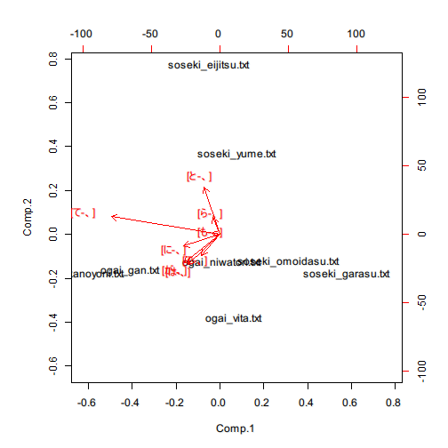

RMeCabパッケージとは
========================================================
RMeCabは日本語形態素解析である MeCab とRを接続するインターフェイスです．RMeCabは以下からダウンロードすることができます．

http://rmecab.jp/wiki/index.php?RMeCab

RMeCabを試す
-------------------------


```r
# RMeCab を利用する準備
library (RMeCab)
```

### 文字を単位としたNgram(bigram)を生成

```r
# 鴎外と漱石それぞれ4作品を含むフォルダを指定
res <- docNgram ("../data/writers", type = 0) # writers はフォルダ名
```

```
## file = ../data/writers/ogai_gan.txt Ngram = 2 
## length = 6069 
## 
## file = ../data/writers/ogai_kanoyoni.txt Ngram = 2 
## length = 5932 
## 
## file = ../data/writers/ogai_niwatori.txt Ngram = 2 
## length = 5888 
## 
## file = ../data/writers/ogai_vita.txt Ngram = 2 
## length = 5760 
## 
## file = ../data/writers/soseki_eijitsu.txt Ngram = 2 
## length = 6097 
## 
## file = ../data/writers/soseki_garasu.txt Ngram = 2 
## length = 5923 
## 
## file = ../data/writers/soseki_omoidasu.txt Ngram = 2 
## length = 6780 
## 
## file = ../data/writers/soseki_yume.txt Ngram = 2 
## length = 5714
```

```r
res2 <- res[ rownames(res) %in% c("[と-、]", "[て-、]", 
                                  "[は-、]", "[が-、]", 
                                  "[で-、]",  "[に-、]",  
                                  "[ら-、]",  "[も-、]" ) ,  ]
res2
```

```
##          Text
## Ngram     ogai_gan.txt ogai_kanoyoni.txt ogai_niwatori.txt ogai_vita.txt
##   [が-、]           66                66                48            63
##   [て-、]          167               194               135           112
##   [で-、]           67                52                76            53
##   [と-、]           47                34                29            36
##   [に-、]           55                81                36            47
##   [は-、]           73                67                35            69
##   [も-、]           10                25                14            21
##   [ら-、]           44                34                37            35
##          Text
## Ngram     soseki_eijitsu.txt soseki_garasu.txt soseki_omoidasu.txt
##   [が-、]                 31                28                  38
##   [て-、]                143                70                 102
##   [で-、]                 37                36                  46
##   [と-、]                 86                24                  29
##   [に-、]                 41                41                  32
##   [は-、]                 40                39                  42
##   [も-、]                 22                10                  18
##   [ら-、]                 51                33                  28
##          Text
## Ngram     soseki_yume.txt
##   [が-、]              33
##   [て-、]             138
##   [で-、]              38
##   [と-、]              41
##   [に-、]              39
##   [は-、]              22
##   [も-、]              13
##   [ら-、]              44
```

```r
res2.pc <- princomp (t (res2))
```

### 主成分分析によるバイプロット


```r
biplot (res2.pc)
```

 
このプロジェクトは以下に公開しています
https://github.com/ishida-m/PublishTest.git

